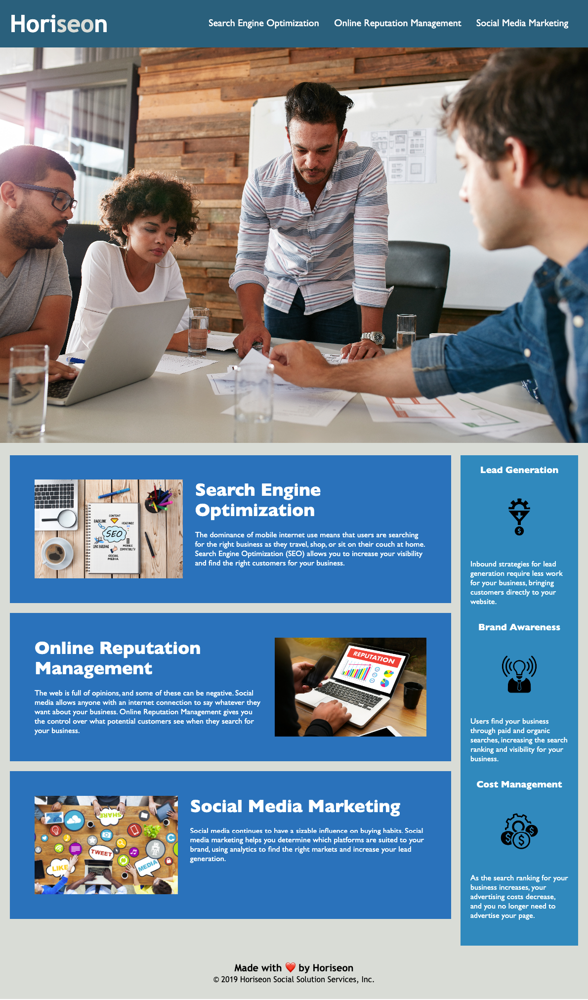

# Make Horiseon Marketing Agency's Home Page Accessible

# User Story
Horiseon asked us to make their site more accessible, so that it is optimzied for search engines. Make the site W3C standard.

# Acceptance Criteria
* Webpage to meet accessibility standards

* Change all html elements to semantic HTML elements

* Add logical structure independent of styling and positioning

* Add Alt tags to images

* Headings to call in sequential order

* Add concise descriptive titles

# Description
* This is the new updated W3C standard homepage for Horiseon Marketing Agency.

# Screenshot

# Live Site
* https://johnxlai.github.io/challenge-1/